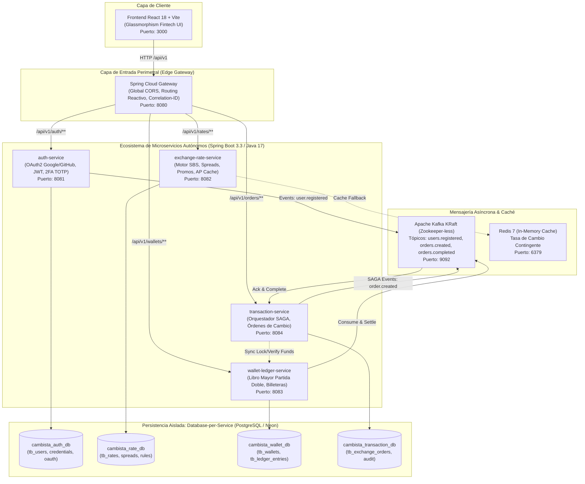
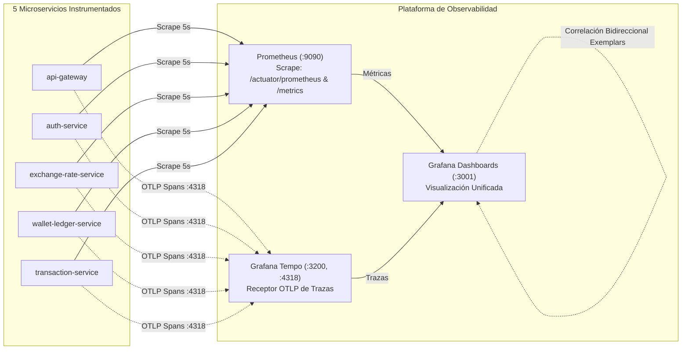

# 📑 Documentación Técnica: Plataforma Fintech Cambista Online VF
## Arquitectura de Microservicios Distribuidos Cloud-Native con Arquitectura Hexagonal

---

## 1. Visión General y Propósito del Proyecto

El proyecto **Cambista Online VF** representa la evolución arquitectural de una plataforma fintech de cambio de divisas, migrando desde un **Monolito Modular Hexagonal** hacia un ecosistema desacoplado de **Microservicios Autónomos Cloud-Native**.

- **Stack Base Backend:** Java 17, Spring Boot 3.3.1, Spring Cloud Gateway (Netty Reactivo).
- **Stack Base Frontend:** React 18, Vite, Zustand (gestión de estado global), UI Glassmorphism Dark-Mode.
- **Mensajería Asíncrona (Event-Driven):** Apache Kafka 7.6.0 en modo **KRaft puro** (Zookeeper-less).
- **Caché y Resiliencia:** Redis 7.2 Alpine (estrategia AP contingente para cotizaciones).
- **Persistencia Aislada (Database-per-Service):** 4 bases de datos relacionales independientes (PostgreSQL 16 en local o **Neon Serverless PostgreSQL** en la nube) con migraciones Flyway descentralizadas.
- **Orquestación y Despliegue:** Docker Compose (perfiles local y Neon) + Manifiestos de Kubernetes con Kustomize (`k8s/`).

---

## 2. Diagrama de Arquitectura del Sistema



---

## 3. Desglose Técnico por Componentes

### 3.1. `api-gateway` (Puerto 8080)
- **Tecnología:** Spring Cloud Gateway reactivo basado en Project Reactor y Netty.
- **Responsabilidades:**
  - Punto de entrada unificado para el frontend, ocultando las direcciones y puertos internos de los microservicios.
  - **CORS Global:** Centraliza las políticas de origen cruzado para permitir llamadas desde el frontend (`http://localhost:3000`).
  - **Trazabilidad Distribuida (`CorrelationIdGlobalFilter`):** Intercepta cada solicitud entrante, genera o propaga el `X-Correlation-Id` hacia los microservicios downstream e inyecta la cabecera en la respuesta HTTP devuelta al cliente.

### 3.2. `auth-service` (Puerto 8081)
- **Bounded Context:** Gestión de Identidad y Acceso (IAM).
- **Base de Datos:** `cambista_auth_db` (tablas de usuarios, credenciales, sesiones y vinculaciones OAuth).
- **Mecanismos de Seguridad:**
  - Autenticación mediante tokens **JWT (`jjwt 0.12.5`)** y contraseñas cifradas con `BCryptPasswordEncoder`.
  - **Doble Factor de Autenticación (2FA / MFA TOTP RFC 6238):** Compatible con Google Authenticator. Implementa persistencia inmutable del secreto y ventana de tolerancia de 14 pasos ($\pm 7$ minutos) para compensar el desvío de reloj (*clock drift*).
  - **OAuth2 Social Login:** Integración con proveedores Google, GitHub y Facebook desacoplados detrás del Gateway.

### 3.3. `exchange-rate-service` (Puerto 8082)
- **Bounded Context:** Motor Algorítmico de Cotización Financiera.
- **Base de Datos:** `cambista_rate_db` (registro histórico de tasas SBS, tablas de spread y reglas de negocio).
- **Diseño de Disponibilidad (AP en Teorema CAP):**
  - Calcula el precio de compra/venta considerando spread estándar/preferente, horario bancario y promociones activas.
  - En caso de indisponibilidad o latencia en la base de datos, recurre a **Redis 7** en memoria para servir la última cotización válida y mantener la alta disponibilidad operativa para el cliente.

### 3.4. `wallet-ledger-service` (Puerto 8083)
- **Bounded Context:** Billetera Multimoneda y Contabilidad Financiera.
- **Base de Datos:** `cambista_wallet_db` (`tb_wallets`, `tb_ledger_entries`, `tb_processed_events`).
- **Principios Financieros:**
  - **Libro Mayor de Partida Doble (*Double-Entry Bookkeeping*):** Toda transacción genera asientos inmutables de débito y crédito; ningún registro contable histórico es sobrescrito.
  - **Soporte Multimoneda:** Billeteras en PEN, USD y EUR.
  - **Consistencia Estricta (CP en Teorema CAP):** Prioriza la integridad y exactitud del saldo sobre la disponibilidad eventual; no permite sobregiros ni doble gasto.
  - **Idempotencia:** Tabla `tb_processed_events` que deduplica eventos de Kafka evitando procesar dos veces el mismo mensaje.

### 3.5. `transaction-service` (Puerto 8084)
- **Bounded Context:** Orquestación de Operaciones de Cambio de Divisas.
- **Base de Datos:** `cambista_transaction_db` (`tb_exchange_orders`, logs de auditoría transaccional).
- **Patrón SAGA con Transacciones de Compensación:**
  - Gestiona la máquina de estados de la orden (`PENDING` $\rightarrow$ `FUNDS_LOCKED` $\rightarrow$ `COMPLETED` / `FAILED` / `CANCELLED`).
  - Solicita el bloqueo preventivo del saldo origen (`USD`) a `wallet-ledger-service`.
  - Si la cotización caduca o ocurre un fallo de red/liquidación, ejecuta la **compensación** (`unlockFunds`), liberando el dinero retenido sin necesidad de bloqueos distribuidos de dos fases (2PC).

### 3.6. `common-proto`
- Librería transversal compartida que contiene contratos de eventos (`OrderCreatedEvent`, `OrderCompletedEvent`, `UserRegisteredEvent`), comandos SAGA (`LockFundsCommand`, `UnlockFundsCommand`, `SettleFundsCommand`), DTOs inmutables (`record`) y utilidades de contexto de trazabilidad (`CorrelationContext`).

### 3.7. `frontend` (Puerto 3000)
- Aplicación de una sola página (SPA) desarrollada en **React 18 + Vite**.
- Diseño moderno Fintech con tema oscuro y efectos visuales Glassmorphism.
- Manejo de estado global reactivo mediante **Zustand** (`useAuthStore`, `useExchangeStore`, `useFxStore`, `useOrderStore`).
- Flujo interactivo: calculadora con cotizaciones en vivo, temporizador de congelamiento de tasa, verificación MFA y confirmación de transferencias.

---

## 4. Matriz de Puertos y Servicios

| Componente | Tipo | Puerto Host | Descripción |
| :--- | :--- | :--- | :--- |
| **`frontend`** | Web UI | `3000` | Aplicación React 18 + Vite |
| **`api-gateway`** | Edge Gateway | `8080` | Punto de entrada perimetral, CORS y enrutamiento |
| **`auth-service`** | Microservicio | `8081` | IAM, JWT, 2FA TOTP y OAuth2 |
| **`exchange-rate-service`** | Microservicio | `8082` | Motor de cotizaciones y spreads |
| **`wallet-ledger-service`** | Microservicio | `8083` | Saldos y libro mayor de partida doble |
| **`transaction-service`** | Microservicio | `8084` | Orquestador SAGA de órdenes de cambio |
| **`kafka`** | Broker Eventos | `9092` / `29092` | Apache Kafka KRaft (Zookeeper-less) |
| **`redis`** | In-Memory Cache | `6379` | Caché de contingencia de cotizaciones |
| **`prometheus`** | Monitoreo | `9090` | Servidor de métricas y scraping en `/metrics` |
| **`tempo`** | Tracing OTel | `3200` / `4318` | Receptor y almacén de trazas distribuidas OpenTelemetry |
| **`grafana`** | Visualización | `3001` | Dashboards interactivos y correlación métricas-trazas |
| **`postgres-auth`** | Base de Datos | `5433` | PostgreSQL local para auth-service |
| **`postgres-rate`** | Base de Datos | `5434` | PostgreSQL local para exchange-rate-service |
| **`postgres-wallet`** | Base de Datos | `5435` | PostgreSQL local para wallet-ledger-service |
| **`postgres-trx`** | Base de Datos | `5436` | PostgreSQL local para transaction-service |

---

## 5. Arquitectura de Observabilidad Centralizada

El ecosistema incorpora observabilidad de grado de producción desacoplada y centralizada:



### 5.1. Métricas con Prometheus
- Cada microservicio cuenta con su propio módulo de métricas (`micrometer-registry-prometheus`), exponiendo endpoints en:
  - `/actuator/prometheus` (Estándar Spring Boot Actuator)
  - `/metrics` (Endpoint nativo compatible con scrapers convencionales)
- Prometheus recolecta cada 5 segundos:
  - **Latencia Percentiles:** Histogramas de petición `http_server_requests_seconds_bucket` para calcular percentiles exactos **p95** y **p99**.
  - **Throughput:** Tasa de solicitudes por segundo (RPS) `rate(http_server_requests_seconds_count[1m])`.
  - **Tasa de Errores:** Filtro por códigos de estado `status=~"[45].."` y cálculo porcentual sobre el tráfico total.

### 5.2. Trazabilidad Distribuida con OpenTelemetry
- Cada microservicio instrumenta **Micrometer Tracing Bridge OTel** con exportador **OTLP (`opentelemetry-exporter-otlp`)**.
- Los spans de cada petición viajan hacia **Grafana Tempo** por HTTP OTLP en el puerto `4318`.
- Los logs de cada microservicio en `logback-spring.xml` inyectan automáticamente el `traceId` y `spanId`, permitiendo cruzar logs con el visor de trazas.

### 5.3. Dashboard en Grafana (`http://localhost:3001`)
- **Acceso:** Usuario `admin`, Contraseña `admin`.
- **Dashboard Pre-aprovisionado:** *"Cambista Online - Observabilidad de 5 Microservicios"*.
- **Paneles Incluidos:**
  1. **Disponibilidad (Health Check):** Estado UP/DOWN en tiempo real de los 5 servicios.
  2. **Latencia p95 y p99:** Gráfica comparativa temporal en milisegundos para detectar degradaciones o cuellos de botella.
  3. **Throughput (RPS):** Peticiones por segundo procesadas por cada componente.
  4. **Tasa de Errores (4xx y 5xx):** Desglose de fallos por servicio y porcentaje relativo de error.
  5. **Explorador de Trazas Tempo:** Visualización del árbol de llamadas distribuidas (`api-gateway` $\rightarrow$ `transaction-service` $\rightarrow$ `wallet-ledger-service`).
  6. **Correlación Métrica-Traza:** Al observar un pico de latencia o error, la configuración de *Exemplars* enlaza directamente al span exacto en Tempo.

---

## 6. Guía de Ejecución Rápida en Local

### Levantar Infraestructura y Observabilidad con Docker:
```powershell
docker compose -f docker-compose.neon.yml up -d
```
*(O `docker compose up -d` si usas PostgreSQL 100% local).*

### Acceso a las Interfaces de Monitoreo:
- **Grafana Dashboards:** `http://localhost:3001` (admin / admin)
- **Prometheus UI:** `http://localhost:9090`
- **Tempo UI:** Integrado directamente en Grafana (pestaña *Explore* $\rightarrow$ *Tempo*)
- **Endpoints de Métricas:**
  - Gateway: `http://localhost:8080/metrics`
  - Auth: `http://localhost:8081/metrics`
  - Rates: `http://localhost:8082/metrics`
  - Wallet: `http://localhost:8083/metrics`
  - Transaction: `http://localhost:8084/metrics`

### Iniciar el Frontend en Desarrollo:
```powershell
cd frontend
npm install
npm run dev
```

La aplicación estará accesible en `http://localhost:3000` consumiendo las APIs a través del Gateway en `http://localhost:8080`.
