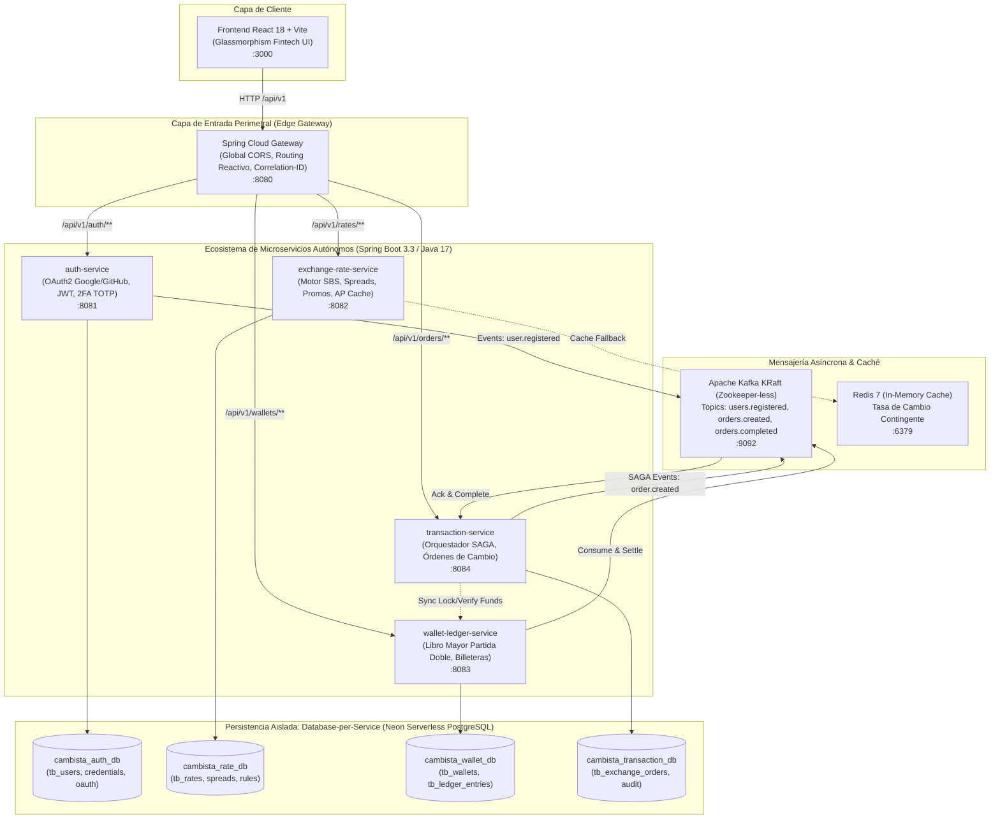

# 💱 Cambista Online VF — Plataforma Fintech de Cambio de Divisas
## Migración Arquitectural: Del Monolito Modular Hexagonal a Microservicios Distribuidos Cloud-Native

> **Contexto del Proyecto Base Replicado:**
> Esta solución (`cambista_online_vf`) es la evolución y migración a microservicios del proyecto base **[CambistaOnline (Rama: `Google-Github-Facebok-MFA`)](https://github.com/pingponista/cambista_online/tree/Google-Github-Facebok-MFA)**. 
> El proyecto origen ya implementaba una **Arquitectura Hexagonal (Ports & Adapters / DDD)** validada con ArchUnit, robustas **medidas de seguridad con autenticación social (Google, GitHub, Facebook)**, **doble factor de autenticación (2FA / MFA TOTP RFC 6238)** y mensajería orientada a eventos con **Apache Kafka y RabbitMQ**.
> 
> **El objetivo de esta migración (`cambista_online_vf`):** Desacoplar el monolito modular hexagonal en un **ecosistema distribuido de microservicios autónomos Cloud-Native**, implementando el patrón **Database-per-Service** sobre **Neon Serverless PostgreSQL**, transacciones distribuidas con **Orquestación SAGA y compensaciones**, **Spring Cloud Gateway** perimetral reactivo con CORS global, y **Apache Kafka KRaft** (Zookeeper-less).

---

## 📑 Tabla de Contenidos
1. [Visión General de la Arquitectura](#-visión-general-de-la-arquitectura)
2. [Tabla Comparativa: Monolito Hexagonal vs. Microservicios Distribuidos](#-tabla-comparativa-monolito-hexagonal-vs-microservicios-distribuidos)
3. [Fundamentos y Decisiones de la Migración](#-fundamentos-y-decisiones-de-la-migración)
   - [Bounded Contexts y Descomposición de Dominios Hexagonales](#1-bounded-contexts-y-descomposición-de-dominios-hexagonales)
   - [Patrón Database-per-Service (Neon Serverless PostgreSQL)](#2-patrón-database-per-service-neon-serverless-postgresql)
   - [Transacciones Distribuidas: Orquestación SAGA con Compensación](#3-transacciones-distribuidas-orquestación-saga-con-compensación)
   - [Evolución de Mensajería: De Broker Dual a Kafka KRaft](#4-evolución-de-mensajería-de-broker-dual-a-kafka-kraft)
   - [Clasificación CAP / PACELC y Resiliencia con Redis](#5-clasificación-cap--pacelc-y-resiliencia-con-redis)
   - [Seguridad Distribuida: OAuth2 y Doble Factor (2FA TOTP)](#6-seguridad-distribuida-oauth2-y-doble-factor-2fa-totp)
4. [Estructura del Repositorio](#-estructura-del-repositorio)
5. [Guía para Levantar en Entorno de Desarrollo](#-guía-para-levantar-en-entorno-de-desarrollo)
   - [Requisitos Previos](#requisitos-previos)
   - [Paso 1: Configurar las 4 Bases de Datos en Neon](#paso-1-configurar-las-4-bases-de-datos-en-neon)
   - [Paso 2: Variables de Entorno del Backend (`.env`)](#paso-2-variables-de-entorno-del-backend-env)
   - [Paso 3: Variables de Entorno del Frontend (`frontend/.env`)](#paso-3-variables-de-entorno-del-frontend-frontendenv)
   - [Paso 4: Iniciar la Infraestructura y Microservicios con Docker](#paso-4-iniciar-la-infraestructura-y-microservicios-con-docker)
   - [Paso 5: Iniciar el Frontend React/Vite](#paso-5-iniciar-el-frontend-reactvite)
6. [Matriz de Puertos y Endpoints del Sistema](#-matriz-de-puertos-y-endpoints-del-sistema)
7. [Observabilidad, Trazabilidad y Diagnóstico](#-observabilidad-trazabilidad-y-diagnóstico)

---

## 🏛 Visión General de la Arquitectura



---

## ⚖ Tabla Comparativa: Monolito Hexagonal vs. Microservicios Distribuidos

| Dimensión Arquitectural | Monolito Hexagonal Base ([`Google-Github-Facebok-MFA`](https://github.com/pingponista/cambista_online/tree/Google-Github-Facebok-MFA)) | Nueva Arquitectura Distribuida (`cambista_online_vf`) | Fundamentación Técnica del Cambio |
| :--- | :--- | :--- | :--- |
| **Topología y Despliegue** | Monolito modular en un único artefacto JAR (`cambista-backend:8080`) empaquetando los módulos `auth`, `engine` y `order`. | **Ecosistema de 4 Microservicios Autónomos** (`:8081` a `:8084`) + **Edge API Gateway** (`:8080`) + Módulo transversal `common-proto`. | Despliegues independientes con ciclo de vida desacoplado. Si el motor de cotizaciones sufre alta carga, escala horizontalmente sin necesidad de replicar el módulo de autenticación o el ledger contable. |
| **Arquitectura de Software Interna** | **Arquitectura Hexagonal (Ports & Adapters)** validada por ArchUnit, con puertos `inbound`/`outbound` en un solo runtime. | **Arquitectura Hexagonal mantenida dentro de cada Bounded Context** pero desacoplada a nivel de proceso de sistema operativo y red. | Preserva la pureza de dominio (DDD) y el desacoplamiento de frameworks, pero ahora cada hexágono es un servicio independiente e invocable por red. |
| **Patrón de Persistencia** | Persistencia híbrida acoplada al mismo proceso: **PostgreSQL** para transacciones y **MongoDB Atlas** para identidades de usuario. | **Database-per-Service Estricto** con **4 Bases de Datos lógicas independientes en Neon Serverless PostgreSQL**. | Elimina el riesgo de "Base de Datos Compartida" (*Shared Database Anti-pattern*). Garantiza soberanía de datos y escalabilidad serverless sin dependencias cruzadas. |
| **Gestión de Esquemas de BD** | Scripts Flyway centralizados (`V1__...` a `V7__...`) ejecutados en un solo arranque. | **Flyway descentralizado e independiente** en el `resources/db/migration` de cada microservicio. | Las migraciones de esquema son aisladas. Un cambio en las tablas de spreads de cotización jamás interrumpe la disponibilidad de la base de datos de usuarios o transacciones. |
| **Transacciones de Negocio** | Transacciones ACID locales gestionadas por `@Transactional` en memoria sobre el mismo pool de conexiones. | **Patrón SAGA Orquestado con Transacciones de Compensación** (`lockFunds` $\rightarrow$ `settleFunds` / `unlockFunds`). | En microservicios no se deben emplear transacciones distribuidas XA de dos fases (2PC) por latencia y bloqueos. SAGA garantiza consistencia eventual resiliente. |
| **Capa de Entrada y Ruteo** | Sin API Gateway. El frontend se comunicaba directamente al único puerto del backend monolítico (`:8080`). | **Spring Cloud Gateway Reactivo (Netty)** en `:8080` con configuración de **CORS Global**, filtro de trazas y balanceo dinámico. | Oculta la topología interna, elimina problemas de CORS entre microservicios y actúa como punto centralizado de seguridad perimetral. |
| **Infraestructura de Mensajería** | Broker dual acoplado: **Apache Kafka 7.5.0** (requería Zookeeper) + **RabbitMQ 3.13** para correos de bienvenida. | **Apache Kafka 7.6 KRaft Puro (Zookeeper-less)** con eventos de dominio transaccionales e idempotencia (`tb_processed_events`). | Reduce la complejidad operativa eliminando Zookeeper y unificando el bus de eventos en una arquitectura Event-Driven pura de alto rendimiento. |
| **Tolerancia y Disponibilidad (CAP / PACELC)** | Modelo no diferenciado: una caída de la base de datos o de proveedores externos degradaba toda la aplicación. | **CP (Consistencia Lineal)** para Wallet y Transacciones; **AP (Alta Disponibilidad con Caché Redis)** para Tasas de Cambio. | Cumple principios financieros: la integridad del dinero no se transige (CP), mientras que la consulta de cotizaciones puede tolerar lecturas cacheadas ante fallos (AP). |
| **Seguridad: Social OAuth2** | Implementación de adaptadores para Google, GitHub y Facebook dentro del mismo monolito. | Adaptadores optimizados en `auth-service` con intercambio de tokens de backend y propagación transparente mediante el API Gateway. | Mantiene la confidencialidad de los `Client Secrets` en el microservicio de backend protegido detrás del Gateway. |
| **Seguridad: 2FA TOTP (RFC 6238)** | Algoritmo TOTP con ventana `WINDOW = 4` (±120s), pero con vulnerabilidad de regeneración de secreto al consultar `/setup`. | **Secreto TOTP inmutable y persistente**; soporte completo con Google Authenticator y **ventana ampliada a ±7 min (14 pasos)**. | Resuelve la pérdida del secreto al refrescar la pantalla y absorbe el desvío de reloj (*clock drift*) común entre dispositivos móviles y máquinas de desarrollo. |
| **Frontend Web** | React 18 + Vite con llamadas directas al puerto del monolito. | **React 18 + Vite** modernizado (Glassmorphism Dark-Mode), estado centralizado con Zustand y proxy reverso `/api/v1` hacia el Gateway. | Interfaz fintech moderna con retroalimentación visual inmediata, gestión reactiva de órdenes y compatibilidad total con 2FA y OAuth. |

---

## 🧠 Fundamentos y Decisiones de la Migración

### 1. Bounded Contexts y Descomposición de Dominios Hexagonales
En el proyecto base (`cambista_online`), la arquitectura hexagonal encapsulaba el dominio con puertos y adaptadores pero compartía el mismo runtime de Spring Boot (`CambistaApplication`). En `cambista_online_vf`, cada **Contexto Delimitado (DDD)** fue promovido a un microservicio independiente con su propia arquitectura hexagonal interna:
- **`auth-service`**: Bounded Context de Identidad y Acceso (IAM). Administra usuarios, contraseñas encriptadas con BCrypt, emisión de JWT, secretos TOTP para Google Authenticator e integración OAuth2 federada (Google y GitHub) detrás del Gateway.
- **`exchange-rate-service`**: Bounded Context de Cotizaciones. Motor algorítmico que calcula el tipo de cambio final aplicando precio base SBS, spread de cliente (Estándar/Preferente), horario bancario y promociones estacionales.
- **`wallet-ledger-service`**: Bounded Context Financiero y de Saldos. Implementa un **Libro Mayor de Partida Doble inmutable** (*Double-Entry Bookkeeping*). Toda operación genera un asiento contable (`tb_ledger_entries`) donde no se modifican filas históricas, garantizando auditoría bancaria.
- **`transaction-service`**: Bounded Context de Operaciones de Cambio. Orquesta el ciclo de vida de cada orden de cambio mediante una máquina de estados finitos (`PENDING`, `FUNDS_LOCKED`, `COMPLETED`, `FAILED`, `CANCELLED`).
- **`common-proto`**: Librería compartida que contiene contratos de eventos (`OrderCreatedEvent`, `OrderCompletedEvent`, `UserRegisteredEvent`) y DTOs comunes, eliminando el acoplamiento directo de código fuente entre microservicios.

### 2. Patrón Database-per-Service (Neon Serverless PostgreSQL)
En el monolito base, la persistencia combinaba MongoDB Atlas y PostgreSQL en un solo proceso. En la arquitectura distribuida:
- Se implementó el patrón estricto **Database-per-Service** con **4 bases de datos relacionales lógicas aisladas en Neon Serverless PostgreSQL**:
  1. `cambista_auth_db`: Almacena `tb_users`, credenciales, cuentas OAuth vinculadas y secretos TOTP.
  2. `cambista_rate_db`: Almacena pares de divisas, reglas de spread y promociones.
  3. `cambista_wallet_db`: Almacena billeteras multimoneda (PEN, USD, EUR), libro mayor y tabla de idempotencia `tb_processed_events`.
  4. `cambista_transaction_db`: Almacena órdenes de cambio y logs de auditoría transaccional.
- Se eliminaron las llaves foráneas (`FOREIGN KEY`) cruzadas entre servicios; las entidades se correlacionan mediante identificadores universales de negocio (`userEmail`, `orderNumber`, `correlationId`).
- Cada microservicio gestiona sus propias migraciones con **Flyway independiente**, permitiendo evolucionar esquemas sin dependencias.

### 3. Transacciones Distribuidas: Orquestación SAGA con Compensación
En el monolito, las operaciones entre usuarios, cotizaciones y órdenes se ejecutaban bajo transacciones ACID locales de base de datos. En microservicios distribuidos:
1. `transaction-service` crea la orden en estado `PENDING` en `cambista_transaction_db`.
2. Solicita el bloqueo preventivo del saldo en origen (`USD`) a `wallet-ledger-service`.
3. `wallet-ledger-service` bloquea los fondos dentro de una transacción ACID local y emite un evento `order.created` al broker de Kafka.
4. Si la conversión se confirma, se asientan las partidas dobles en el ledger contable y la orden pasa a `COMPLETED`.
5. Si ocurre algún error en la cotización o liquidación, se ejecuta la **transacción de compensación** (`unlockFunds`), liberando el saldo retenido sin inconsistencias financieras y sin bloqueos de dos fases (2PC).

### 4. Evolución de Mensajería: De Broker Dual a Kafka KRaft
El proyecto base requería coordinar Zookeeper, Apache Kafka 7.5 y RabbitMQ simultáneamente:
- En `cambista_online_vf` se unificó la mensajería asíncrona en **Apache Kafka 7.6 en modo KRaft (Zookeeper-less)**, reduciendo drásticamente la huella de memoria y la complejidad operativa.
- Se implementó un mecanismo de **idempotencia y deduplicación** en los consumidores mediante la tabla `tb_processed_events`, evitando procesamiento duplicado ante reintentos de red.

### 5. Clasificación CAP / PACELC y Resiliencia con Redis
- **Wallet & Transaction (`CP` en CAP / `PC/EC` en PACELC)**: Durante una partición de red, el sistema prefiere denegar la operación antes que permitir un saldo negativo o un gasto duplicado.
- **Exchange Rate (`AP` en CAP / `PA/EL` en PACELC)**: Si la comunicación con la base de datos de tasas experimenta latencia o caída, el servicio recurre inmediatamente a **Redis Cache (puerto :6379)** sirviendo la última cotización válida para mantener alta disponibilidad en el cliente.
- **Resiliencia y Circuit Breaker**: Llamadas inter-servicio protegidas con timeouts controlados y degradación elegante.

### 6. Seguridad Distribuida: OAuth2 y Doble Factor (2FA TOTP)
- **Social OAuth2 Detrás del Edge Gateway**: 
  - El frontend interactúa únicamente con el API Gateway en `/api/v1/auth/oauth/{provider}`.
  - El Gateway canaliza la petición al `auth-service`, donde se realiza el intercambio seguro del código de autorización con Google y GitHub mediante `Client Secrets` protegidos.
- **Doble Factor con Google Authenticator (RFC 6238)**:
  - **Inmutabilidad del Secreto**: Se corrigió el problema del proyecto base donde consultar el setup de MFA podía mutar el estado o invalidar el secreto previo. En `cambista_online_vf`, una vez activado, el secreto permanece inmutable hasta que el usuario decida conscientemente desactivarlo con un código válido.
  - **Tolerancia Ampliada contra Clock Drift**: Se adaptó el `TotpAdapter.java` a una ventana de tolerancia de `WINDOW = 14` ($\pm 7$ minutos) con logging diagnóstico SLF4J, garantizando que variaciones horarias entre el reloj del smartphone y el host de desarrollo (Docker/Windows) no rechacen códigos válidos de Google Authenticator.

---

## 📂 Estructura del Repositorio

```text
cambista_online_vf/
├── pom.xml                               # POM padre Maven Multi-Módulo (Java 17)
├── docker-compose.neon.yml               # Orquestación Docker conectada a Neon Serverless
├── docker-compose.yml                    # Orquestación con PostgreSQL local alternativo
├── .env.example                          # Plantilla de variables de entorno segura
├── common-proto/                         # Módulo compartido de contratos, eventos DTO y protobuf
├── auth-service/                         # Microservicio de Autenticación, OAuth2 y 2FA TOTP
│   ├── Dockerfile                        # Multi-stage build optimizado
│   └── src/main/resources/db/migration/  # Migraciones Flyway para cambista_auth_db
├── exchange-rate-service/                # Microservicio de Cotizaciones SBS y Spreads
│   ├── Dockerfile
│   └── src/main/resources/db/migration/  # Migraciones Flyway para cambista_rate_db
├── wallet-ledger-service/                # Microservicio de Billeteras y Libro Mayor
│   ├── Dockerfile
│   └── src/main/resources/db/migration/  # Migraciones Flyway para cambista_wallet_db
├── transaction-service/                  # Microservicio de Órdenes y Orquestación SAGA
│   ├── Dockerfile
│   └── src/main/resources/db/migration/  # Migraciones Flyway para cambista_transaction_db
├── api-gateway/                          # Spring Cloud Gateway (CORS global y ruteo reactivo)
│   └── Dockerfile
├── frontend/                             # Frontend React 18 + Vite (Glassmorphism UI)
│   ├── .env.example                      # Plantilla de variables públicas del cliente
│   ├── package.json
│   ├── vite.config.js                    # Proxy reverso hacia API Gateway (:8080)
│   └── src/
└── k8s/                                  # Manifiestos de Kubernetes (Deployments, Services, ConfigMaps)
```

---

## 🚀 Guía para Levantar en Entorno de Desarrollo

Sigue estos pasos para desplegar toda la plataforma en tu entorno local conectada a **Neon Serverless PostgreSQL**.

### Requisitos Previos
- **Docker Desktop** (No requiere iniciar sesión / modo Guest habilitado).
- **Node.js 18+** y **npm** (para ejecutar el frontend).
- Una cuenta gratuita en [Neon Console](https://console.neon.tech).

---

### Paso 1: Configurar las 4 Bases de Datos en Neon
1. Ingresa a tu proyecto en [Neon Console](https://console.neon.tech).
2. En el menú lateral izquierdo, haz clic en **Databases** $\rightarrow$ **New Database**.
3. Crea las 4 bases de datos lógicas:
   - `cambista_auth_db`
   - `cambista_rate_db`
   - `cambista_wallet_db`
   - `cambista_transaction_db`
4. En el Dashboard principal de Neon, copia tu string de conexión PostgreSQL en modo **Pooled** (ejemplo):
   ```text
   postgresql://<usuario>:<password>@<host-neon-pooler>/neondb?sslmode=require
   ```

> [!NOTE]
> **No necesitas crear tablas ni columnas manualmente.** Cuando los microservicios se inicien, **Flyway ejecutará automáticamente los scripts SQL** y construirá todo el esquema e índices en Neon.

---

### Paso 2: Variables de Entorno del Backend (`.env`)
En la raíz del proyecto (`cambista_online_vf/`), copia la plantilla `.env.example` a un nuevo archivo `.env`:

```powershell
cp .env.example .env
```

Abre `.env` y completa tus credenciales (el archivo `.env` ya se encuentra protegido en `.gitignore` para nunca ser publicado en repositorios):

```env
# =============================================================================
# PERSISTENCIA EN NEON SERVERLESS POSTGRESQL
# =============================================================================
# Endpoint de tu proyecto en Neon (usa preferentemente el host con -pooler)
NEON_HOST=ep-tu-proyecto-pooler.sa-east-1.aws.neon.tech

# Usuario y contraseña de Neon
NEON_USER=neondb_owner
NEON_PASSWORD=tu_password_secreto_de_neon

# URLs de conexión JDBC por microservicio (Database-per-Service)
SPRING_DATASOURCE_AUTH_URL=jdbc:postgresql://${NEON_HOST}/cambista_auth_db?sslmode=require
SPRING_DATASOURCE_RATE_URL=jdbc:postgresql://${NEON_HOST}/cambista_rate_db?sslmode=require
SPRING_DATASOURCE_WALLET_URL=jdbc:postgresql://${NEON_HOST}/cambista_wallet_db?sslmode=require
SPRING_DATASOURCE_TRX_URL=jdbc:postgresql://${NEON_HOST}/cambista_transaction_db?sslmode=require

SPRING_DATASOURCE_USERNAME=${NEON_USER}
SPRING_DATASOURCE_PASSWORD=${NEON_PASSWORD}

# =============================================================================
# SEGURIDAD JWT
# =============================================================================
JWT_SECRET=404E635266556A586E3272357538782F413F4428472B4B6250645367566B5970
JWT_EXPIRATION_MS=3600000

# =============================================================================
# APACHE KAFKA (BROKER INTERNO DOCKER)
# =============================================================================
KAFKA_BOOTSTRAP_SERVERS=localhost:9092

# =============================================================================
# OAUTH2 / SOCIAL LOGIN CREDENTIALS (BACKEND)
# =============================================================================
OAUTH_GOOGLE_CLIENT_ID=tu_google_client_id.apps.googleusercontent.com
OAUTH_GOOGLE_CLIENT_SECRET=tu_google_client_secret

OAUTH_GITHUB_CLIENT_ID=tu_github_client_id
OAUTH_GITHUB_CLIENT_SECRET=tu_github_client_secret
```

---

### Paso 3: Variables de Entorno del Frontend (`frontend/.env`)
En la carpeta `frontend/`, verifica o crea el archivo `.env`:

```env
# URL relativa para consumir el API Gateway mediante el proxy inverso de Vite
VITE_API_URL=/api/v1

# Client IDs públicos de OAuth2 (sin secrets)
VITE_OAUTH_GOOGLE_CLIENT_ID=tu_google_client_id.apps.googleusercontent.com
VITE_OAUTH_GITHUB_CLIENT_ID=tu_github_client_id
VITE_OAUTH_FACEBOOK_APP_ID=
```

> [!TIP]
> **Configuración en Google Cloud y GitHub Developers:**
> - En Google Cloud Console (OAuth 2.0 Client IDs), autoriza los orígenes JavaScript: `http://localhost:3000` y las URIs de redirección: `http://localhost:3000/login`.
> - En GitHub Developer Settings (OAuth Apps), configura Authorization Callback URL: `http://localhost:3000/login`.

---

### Paso 4: Iniciar la Infraestructura y Microservicios con Docker
En la raíz del proyecto, ejecuta:

```powershell
docker-compose -f docker-compose.neon.yml up -d
```

Este comando descargará e iniciará:
1. **Apache Kafka KRaft** (mensajería asíncrona unificada).
2. **Redis 7** (caché en memoria para cotizaciones SBS).
3. **`auth-service`**, **`exchange-rate-service`**, **`wallet-ledger-service`** y **`transaction-service`** conectándose automáticamente con SSL a tus bases de datos en Neon.
4. **`api-gateway`** exponiendo el punto de entrada unificado con CORS habilitado en el puerto `:8080`.

Para verificar el estado de los contenedores:
```powershell
docker-compose -f docker-compose.neon.yml ps
```
Todos los servicios deben figurar en estado `Up` o `healthy`.

---

### Paso 5: Iniciar el Frontend React/Vite
Abre una terminal en la subcarpeta `frontend/`:

```powershell
cd frontend
npm install
npm run dev
```

El servidor de desarrollo iniciará de inmediato en:
👉 **`http://localhost:3000`**

---

## 📡 Matriz de Puertos y Endpoints del Sistema

| Servicio / Componente | Puerto | Protocolo / URL | Descripción |
| :--- | :--- | :--- | :--- |
| **Frontend Web** | `3000` | HTTP `http://localhost:3000` | Interfaz interactiva de usuario y dashboard fintech. |
| **API Gateway** | `8080` | HTTP `http://localhost:8080/api/v1` | Enrutador unificado, CORS global y propagación de trazas. |
| **Auth Service** | `8081` | HTTP / Swagger `http://localhost:8081/swagger-ui.html` | IAM, Registro, Login, OAuth2 y 2FA TOTP. |
| **Exchange Rate Service** | `8082` | HTTP / Swagger `http://localhost:8082/swagger-ui.html` | Motor de cálculo SBS, spreads y promociones. |
| **Wallet & Ledger Service**| `8083` | HTTP / Swagger `http://localhost:8083/swagger-ui.html` | Libro contable de partida doble y saldos multimoneda. |
| **Transaction Service** | `8084` | HTTP / Swagger `http://localhost:8084/swagger-ui.html` | Orquestación SAGA y ciclo de vida de órdenes. |
| **Apache Kafka Broker** | `9092` | PLAINTEXT `localhost:9092` | Bus de eventos transaccionales guiado por eventos. |
| **Redis Cache** | `6379` | RESP `localhost:6379` | Almacén de alta velocidad para contingencia de cotizaciones. |
| **Neon Console** | Cloud | HTTPS `https://console.neon.tech` | Persistencia serverless, backups y visor SQL en vivo. |

---

## 🔍 Observabilidad, Trazabilidad y Diagnóstico

### Trazabilidad con `X-Correlation-Id`
Cada petición que entra por el frontend o por el Gateway recibe o genera un header `X-Correlation-Id`. Este identificador se propaga en los logs de Spring Boot a través de todos los microservicios y en los headers de Kafka, permitiendo reconstruir el flujo de una transacción financiera completa de punta a punta.

### Comandos Útiles de Diagnóstico
- **Ver logs en tiempo real de todos los microservicios:**
  ```powershell
  docker-compose -f docker-compose.neon.yml logs -f
  ```
- **Ver logs de un servicio específico (ej. autenticación y 2FA):**
  ```powershell
  docker-compose -f docker-compose.neon.yml logs -f auth-service
  ```
- **Verificar salud de los microservicios (Actuator):**
  ```powershell
  curl.exe http://localhost:8080/actuator/health
  ```
- **Detener el ecosistema completo:**
  ```powershell
  docker-compose -f docker-compose.neon.yml down
  ```

---
*Desarrollado con Arquitectura Hexagonal Limpia, Domain-Driven Design (DDD) y Patrones de Sistemas Distribuidos para Fintech.*
